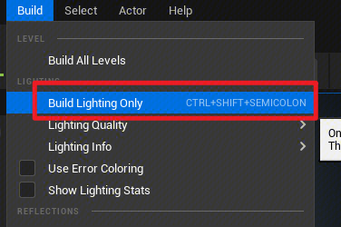
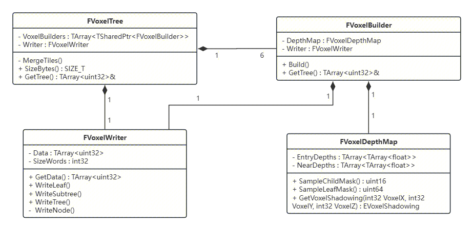
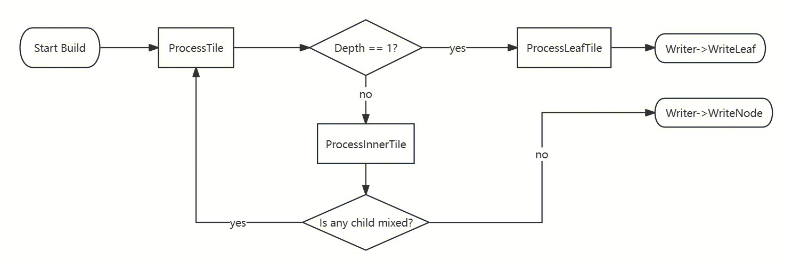
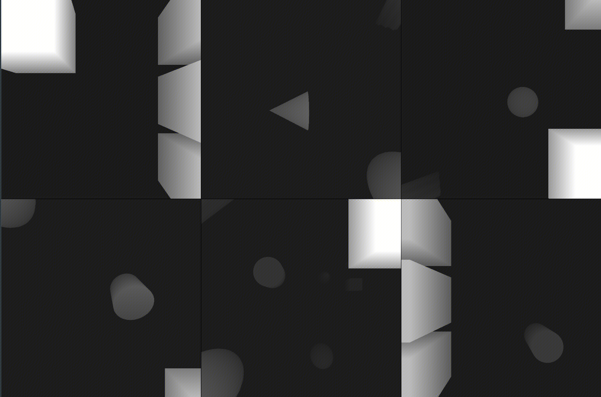
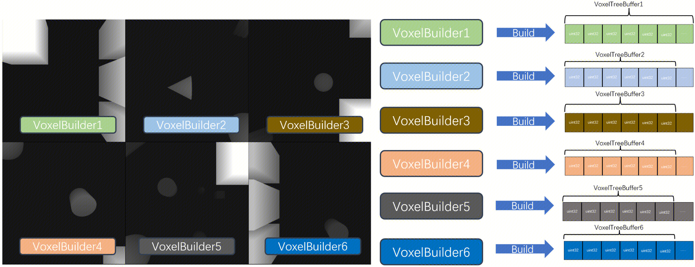
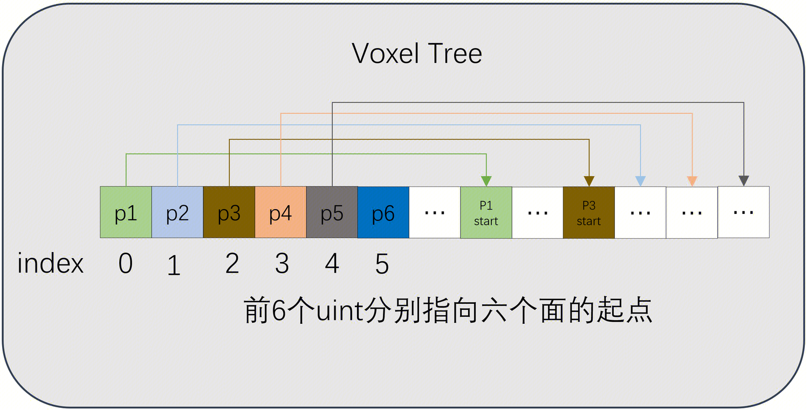

# 项目介绍

## 1. 在UE5中实现Voxelized Shadow

### 1.1 为什么要做这个？
对Point Light的静态Shadow Map进行压缩主要有以下三个原因：

- 光照贴图存储静态阴影的局限性：1. 光照贴图仅适用于具有表面的物体，并不适用体积、动态网格的接收物。2. 光照贴图需要定制UV。 3. 光照贴图将会导致较大的内存占用。
- 直接使用预计算的Shadow Map，会导致较大的内存占用。Point Light的Shadow Map是一个CubeMap，假设shadow map的分辨率为1024，深度值使用 2 bytes进行存储，则需要占用 6 X 1024 X 1024 X 2 = 12M 显存，
- 如有一种方法能够对shadow map进行压缩，降低其显存占用，会很有意义。

## 1.2 Voxelized Shadow是什么？
我在UE5中实现了一种针对Stationary Point Light的基于体素的Shadow Map压缩方法。
>> idea 来源于Erik Sintorn、Viktor Kampe等的论文：[Compact Precomputed Voxelized Shadows](https://dl.acm.org/doi/abs/10.1145/2601097.2601221)，以下出现的“原论文”，指的便是这篇文章。该论文的源码已开源：[Voxelized Shadow GitHub](https://github.com/loinesg/voxelized-shadows)。该论文针对定向光源的Shadow Map进行了压缩，本文参照其开源代码，在虚幻中实现了Point Light的Voxelized Shadow。

需要注意的是，Voxelized Shadow并非实时压缩，而是预计算的，这意味着runtime时Voxelized Shadow的阴影数据不会发生变化，即其只支持静态阴影。Voxelized Shadow可以结合CSM方法一起使用，针对静态的物体使用Voxelized Shadow，针对动态的物体使用CSM方法。

传统Shadow Map中存储的是深度值，通过比较着色点在光源视图下的深度与Shadow Map的深度来获取阴影值，但传统Shadow Map的数据不够紧凑，依然有很大的压缩空间。

### 1.2.1 核心流程
Voxel Shadow是基于体素划分的方法，使用可见性代替深度，以一种更加紧凑的数据结构存储阴影数据。其核心的算法如下：

1. 将光源覆盖的整个空间范围看做是最大的一个体素。
2. 将当前体素从X、Y、Z坐标的中间位置各切一刀，共分为八份，每一部分为一个子体素，逐一判断每个体素的状态：
    - Shadowed ：该体素完全位于阴影内
    - UnShadowed：该体素完全位于阴影外
    - Mixed：该体素有部分位于阴影内，部分位于阴影外
3. 若子体素的状态为Shadowed或为UnShadowed，记录体素状态并退出，不再继续划分。若体素状态为Mixed，则继续执行步骤 2 直到划分至最大分辨率（划分至叶子结点）。

### 1.2.2 体素划分
我们并非直接对世界空间进行划分，而是在光视图空间中进行划分，这样划分有利于进行压缩。如 2-2-1左图，若直接在世界空间中划分，边缘处的像素会出现各种锯齿，其X、Y、Z值可能都不相同，不易进行压缩。如 2-2-1右图，若在光视图空间中进行划分，有很多X、Y坐标相同的体素具有相同的状态，容易进行压缩。

原论文是针对定向光源进行实现的，其投影方式为正交投影，故可以直接对光源视图空间中的整个场景的包围盒进行划分，体素的大小与世界空间中的实际大小是相对应的。

原论文中定向光源体素划分示意图

 
而本文是实现点光源的Voxel Shadow，点光源的投影方式为透视投影，我们无法像定向光源那样直接按照视图空间坐标进行划分。于是我提出一种针对透视投影的非均匀划分方式，如下图

从图中可知，定向光源的投影方式为正交投影，其视椎体是一个立方体(其实是长方体，但在具体实现时会将其扩为一个立方体)，这能够保证投影前后的一致性，使每一次划分出的体素都为立方体。

而点光源的投影方式为透视投影，它的视椎体是一个棱台，我们不能再像正交投影那样在视图空间中均匀划分，而且透视投影的Z坐标在投影前后并非是线性变化的。于是本文提出一种非均匀地划分方式：**按照Shadow Map的像素坐标划分X、Y，但是按照光视图坐标来均匀划分Z，这样能够保证划分结果是符合点光源的Shadow Map结果的。**

根据这种划分方式，每个体素不再是标准的立方体，而是一个个小棱台，同时近处对应的体素更小，而远处对应的体素更大。

### 1.2.3 状态存储
最终，该算法能够得到一棵八叉树。

若每个结点单独存储自己的状态信息，会导致存储效率较低（状态值仅有 2 个bit）。故在具体实现时，是每个结点的父结点存储自己子结点的状态信息。由上文可知，状态信息一共包含3个(Shadowed, UnShadowed, Mixed)，三种状态可以由 2 位二进制数进行表示，而每个结点最多具有8个子结点，故可以使用2 * 8=16位数表示 8 个子结点的可见性。

为方便做PCF，当划分到8x8x8的时候，不再使用以往的划分方法，而是只在Z轴方向划分，将其划分为8个8x8x1大小的片，这个8x8x1的片即为一个叶子结点，该片中含有64个体素，因为这个时候的体素不会是Mixed，故每个体素只用使用一个bit存储可见性，可以直接使用64bit进行存储。

## 1.3 具体实现
### 1.3.1 Lightmass任务准备
构建Voxelized Shadow实质上就是构建一棵八叉树，是一个预计算的过程，所以我们选择将任务放在Lightmass中进行处理。

我们选择在光照构建时，构建Voxel Shadow Tree。当点击“Build Lighting Only”开启光照构建时，会遍历场景中的所有点光源，如果点光源中的Enable Voxel Shadow （在LightComponent中添加的变量）被启用，则会在Lightmass添加对应的构建任务。

们在LightComponent中加入了VoxelShadow相关的两个属性：
- EnableVoxelShadow: 该属性用于控制是否启用VoxelShadow，若启用，则在构建光照时将会构建Voxel Shadow。
- VoxelShadowResolution: 该属性控制Voxel Shadow的分辨率，分辨率越高，构建时间越长，生成的数据结构占用空间越大，shader遍历树时间也会越长，但质量越高。

在点击“Build Lighting Only”，会开启一些列构建准备工作，并将构建任务发送至Swarm中。
（省略代码）
其中IssueVoxelShadowBuildTask函数调用Swarm的AddTask函数，将我们的Build任务提交至Swarm，Lightmass进程就能够从Swarm中去读取该任务。其中TaskSpecification会对Task进行描述，构造TaskSpecification需要传递一个Guid参数以标识具体任务，我们在LightComponent中声明一个VoxelShadowTaskGuid，以区分该任务与其他光照构建任务，该Guid在Light Component的构造函数中初始化。

在实际Build 之前，还需要将信息传递给Lightmass，其函数是FLightmassExporter::WriteLights
在该函数中，将我们Voxelized Shadow的相关数据传递给Lightmass，主要包括ShadowMap分辨率、Bias、Task Guid等数据。

Lightmass会调用 Swarm->Read(Data, NumBytes) 函数从Swarm中读取unreal传递过来的数据。

在启动Lightmass之后，Lightmass会不断地调用 FStaticLightingMapping* FStaticLightingSystem::ThreadGetNextMapping函数，从Swarm中读取任务的Guid，我们通过比对该Guid是否与接收的数据中的Guid相同，来判断是否开启构建Voxelized Shadow任务。

至此，调用CalculateVoxelTreeData便会开启构建 Voxelized Shadow。

### 1.3.2 算法具体实现

算法实现部分主要包含以下四个类，UML类图如图下

#### 1.3.2.1 FVoxelTree
FVoxelTree负责统筹整棵Voxelized Shadow Tree的Build。在FVoxelTree构造函数中，FVoxelTree 会创建 6 个FVoxelBuilder，每一个FVoxelBuilder负责一个面的Build。在完成所有面的Build之后，它会调用MergeTiles将多个FVoxelBuilder的构建结果进行合并，见4.5。
   

#### 1.3.2.2 FVoxelBuilder
FVoxelBuilder：FVoxelBuilder 负责进行实际的单次Build。由于Point Light 不同于Directional Light，Point Light的Shadow Map具有 6 个面，所以Build时需要对 6 个面的Shadow Map分开单独Build，为了使得每个面的Build流程相互独立，我们创建不同的FVoxelBuilder进行Build。同时，将构建流程分成多个FVoxelBuilder单独进行Build，也方便进行多线程优化（2024.06.01 已实现多线程）。FVoxelBuilder构造函数会创建Build所必须的两个组件：FVoxelDepthMap 与 FVoxelWriter。

在FVoxelBuilder的构造函数中，会调用各个FVoxelBuilder的Build函数。Build函数是整个Voxelized Shadow方法的核心，它会将当前场景进行不断划分并形成一棵八叉树。Build函数中各个成员函数的调用逻辑如下：

- ProcessTile：处理结点的统一调用
- ProcessInnerNode: 处理内部结点（非叶子结点），该函数内部会对当前体素进行X、Y、Z划分，并根据DepthMap对象查询各个子结点的状态信息，形成uint32的ChildMask。
- ProcessLeafTile：处理叶子结点，该函数会直接查询Shadow Map，并根据DepthMap对象查询所有子像素的可见性信息，形成uint64的LeafMask。

#### 1.3.2.3 FVoxelDepthMap
FVoxelDepthMap 负责查询体素的阴影信息。

上文提到，我们在对体素划分时需要查询每个体素的状态信息(Shadowed, UnShadowed, Mixed)，而FVoxelDepthMap就提供查询状态信息的一系列查询接口。

我参考了Lightmass生成Directional Light Shadow Map函数 FStaticLightingSystem::CalculateStaticShadowDepthMap的实现，该函数通过发射射线求交的方式得到深度，生成Shadow Map。基于此实现，我们在Lightmass中实现了在CPU上生成Point Light 的 Shadow Map。在该函数中，我们逐一遍历每个像素，得到每个像素在世界空间中的坐标，并调用AggregateMesh->IntersectLightRay函数获取像素射线与场景的交点，根据交点坐标间接获取Shadow Map中像素的深度值。为防止Z fighting，我们将Z坐标使用inversed-Z 进行存储。其结果如下

为快速查询不同大小体素的阴影信息，我们需要基于Shadow Map生成不同Mip层级的Shadow Map。
获取上一级mip中的2x2像素中最大和最小深度值，以形成当前mip，这样就可以进行快速判断：当深度值小于最小值，则为unshadowed，大于最大值，则为shadowed，在中间则为mixed。

在之后读取Shadow Map的时，可以根据体素的大小迅速锁定mip层级，以快速获取阴影信息。

对于非叶子结点的内部结点，我们根据结点的大小计算其参考的mip层级，然后读取Shadow Map，将深度转换到线性空间中进行比较。

内部结点一共包含 8 个子节点，各个子节点的状态信息存储于ChildMask的指定位置。

对于叶子结点，其体素与Shadow Map的像素直接对应，此时直接采样mip层级为0的Shadow Map。

叶子结点的维度为8x8x1，一共包含64个体素，我们使用一个uint64(LeafMask)来表示该 64 个体素的可见性。

#### 1.3.2.4 FVoxelWriter

FVoxelWriter 负责将结点数据写入一维的uint32数组中，并负责形成底层树状结构的组织形式。

从UML类图中可以看到，FVoxelTree 与 FVoxelBuilder 都含有一个FVoxelWriter。

多个FVoxelBuilder在Build时是相互独立的，故每个FVoxelBuilder内部都需要有一个FVoxelWriter维护一棵树（这棵树是存储在FVoxelWriter中的）。

而FVoxelTree也需要一个FVoxelWriter将多个FVoxelBuilder的树进行合并，形成一个大的Buffer。

#### 1.3.2.5 Merge
在每一个FVoxelBuilder都完成Build时，FVoxelTree 需要读取所有FVoxelBuilder的树，通过调用自己的Writer的WriterSubTree函数，将6个FVoxelBuilder中的子树全部合并到自己的Writer中，从而形成一个含有 6 个面数据的buffer。

为了方便之后的shader能够快速找到自己那一面的树的根结点，我们将这个大buffer的头 6 个uint32 放入六个面对应的树的起点索引(Writer->SetRootNodePointer(FaceIndex, Ptr);)，如下图

## 1.4 遇到的问题与解决方式

### 1.4.1 Leaf Expanding
### 1.4.2 重投影性能优化

## 1.5 效果与性能

具体导出方式为通过Swarm的接口Swarm->OpenChannel新建一个Channel，Channel的名字为VoxelShadow的Guid以及一些后缀组成，后续unreal如果要从该Channel中读取数据，其Channel的名字应该与该名字保持一致。通过Swarm->Write与WriteArray函数将数据写入该Channel。

## 1. 基于SceneExtension实现的体积云

该体积云项目完全由本人独立开发，为自己的硕士研究方向。该项目利用UE4的Global Shader与RDG进行自定义渲染，通过空间上采样与重投影的方法提高体积云渲染性能。同时优化体积云多重散射，进一步提高体积云的真实性。

### 1. 效果图

### 2. 重投影与空间上采样降低整体每一帧渲染的像素数量

在空间上，将屏幕分辨率降低为原来的一半，最后利用插值的办法将结果进行上采样，有效降低
整体渲染的像素数量。在时间上，通过每一帧渲染一个4x4的block中的一个像素，从而降低每一帧需要渲染的像素数量。以下为算法的流程：

连续16帧绘制出完整的画面

通过重投影消除伪影

空间上采样的对比图

### 3. 多重散射近似

只有beer powder

添加光线衰减

添加大气透视

添加多重散射近似

添加Ambient Light

添加能量守恒方程

### 4. 自己提出的多重散射近似方法与其余两种方法的对比

### 5. 性能对比实验

