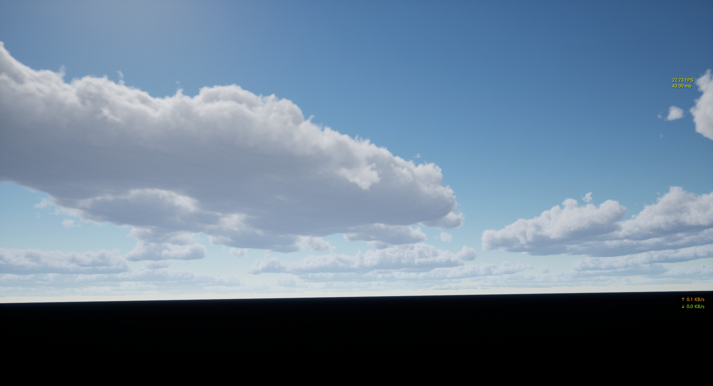
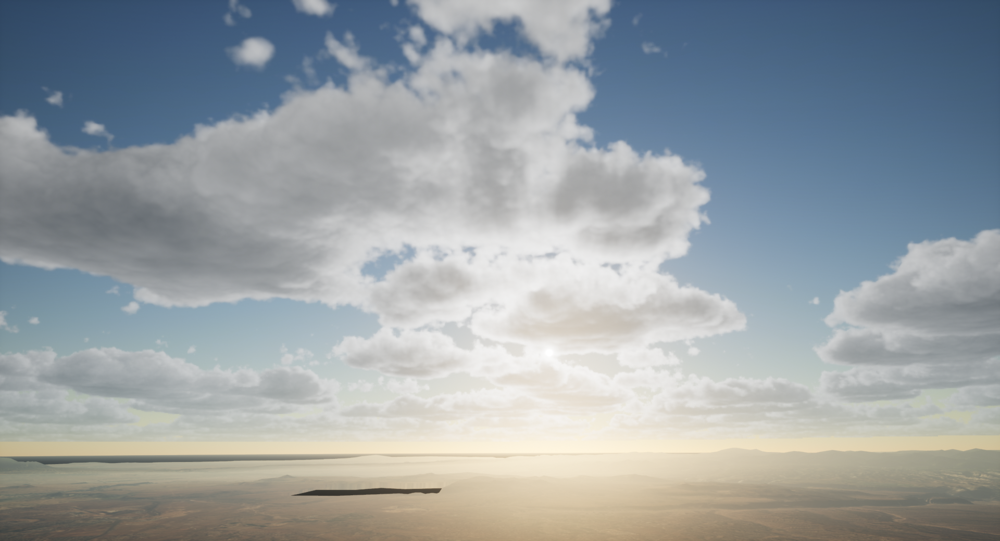
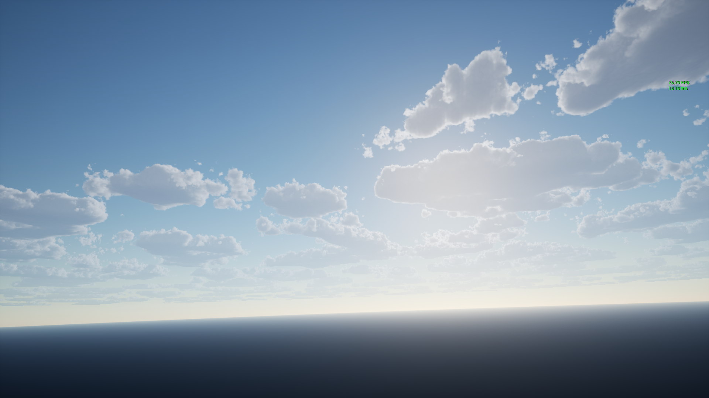
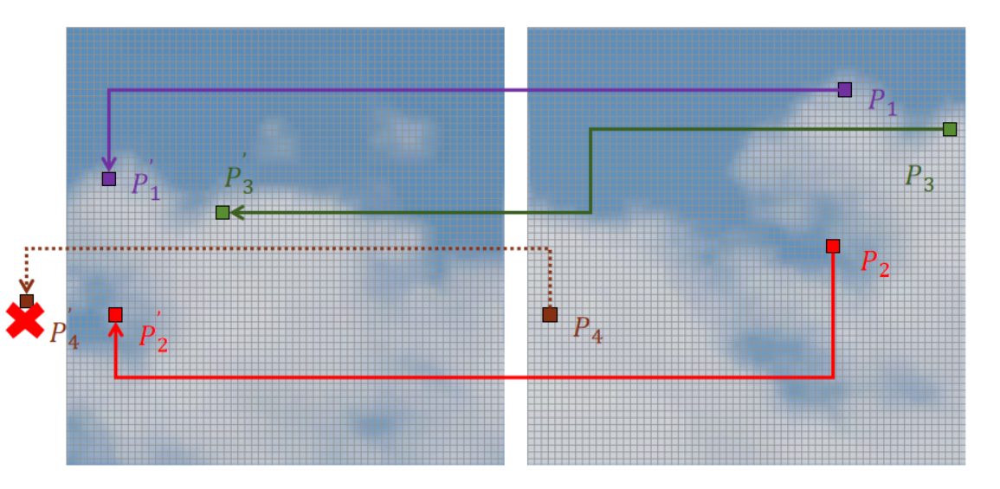
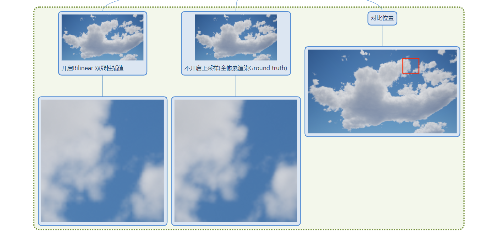
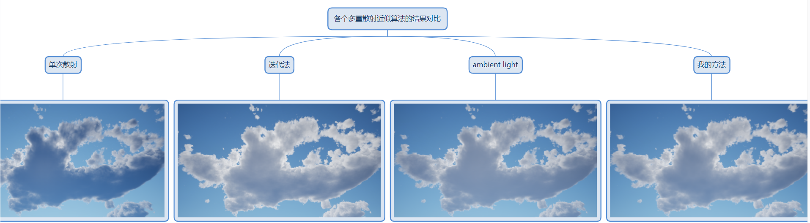
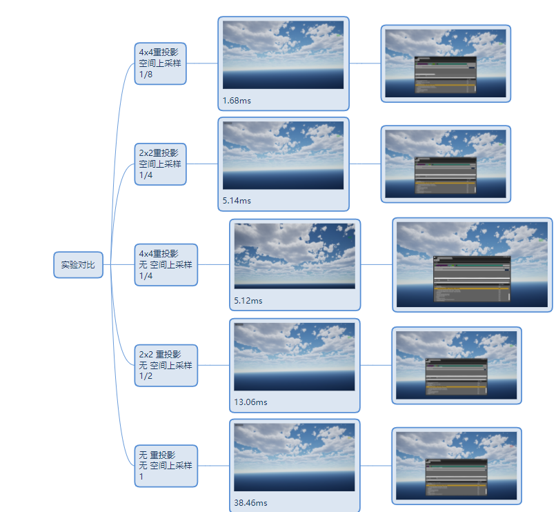

## 由虚幻GlobalShader实现的体积云(非体积云组件)

该体积云项目完全由本人独立开发，为自己的硕士研究方向。该项目利用UE4的Global Shader与RDG进行自定义渲染，通过空间上采样与重投影的方法提高体积云渲染性能，在1050显卡上仅耗费***1.5ms**能够渲染出高质量体积云，渲染性能高于虚幻(**渲染用时4ms**)。同时优化体积云多重散射，进一步提高体积云的真实性。

### 1. 效果图

### 2. 重投影与空间上采样降低整体每一帧渲染的像素数量

在空间上，将屏幕分辨率降低为原来的一半，最后利用插值的办法将结果进行上采样，有效降低整体渲染的像素数量。在时间上，通过每一帧渲染一个4x4的block中的一个像素，从而降低每一帧需要渲染的像素数量。以下为算法的流程：

连续16帧绘制出完整的画面

通过重投影消除伪影

空间上采样的对比图

### 3. 多重散射近似

只有beer powder

添加光线衰减

添加大气透视

添加多重散射近似

添加Ambient Light

添加能量守恒方程

### 4. 自己提出的多重散射近似方法与其余两种方法的对比

### 5. 性能对比实验

