# 项目介绍

## 1. 在UE5中实现Voxelized Shadow

### 1.1 为什么要做这个？
对Point Light的静态Shadow Map进行压缩主要有以下三个原因：

- 光照贴图存储静态阴影的局限性：1. 光照贴图仅适用于具有表面的物体, 并不适用体积、动态网格的接收物。2. 光照贴图需要定制UV。 3. 光照贴图将会导致较大的内存占用。
- 直接使用预计算的Shadow Map, 会导致较大的内存占用。Point Light的Shadow Map是一个CubeMap, 假设shadow map的分辨率为1024, 深度值使用 2 bytes进行存储, 则需要占用 6 X 1024 X 1024 X 2 = 12M 显存, 
- 如有一种方法能够对shadow map进行压缩, 降低其显存占用, 会很有意义。

## 1.2 Voxelized Shadow是什么？
我在UE5中实现了一种针对Stationary Point Light的基于体素的Shadow Map压缩方法。
>> idea 来源于Erik Sintorn、Viktor Kampe等的论文：[Compact Precomputed Voxelized Shadows](https://dl.acm.org/doi/abs/10.1145/2601097.2601221), 以下出现的“原论文”, 指的便是这篇文章。该论文的源码已开源：[Voxelized Shadow GitHub](https://github.com/loinesg/voxelized-shadows)。该论文针对定向光源的Shadow Map进行了压缩, 本文参照其开源代码, 在虚幻中实现了Point Light的Voxelized Shadow。

需要注意的是, Voxelized Shadow并非实时压缩, 而是预计算的, 这意味着runtime时Voxelized Shadow的阴影数据不会发生变化, 即其只支持静态阴影。Voxelized Shadow可以结合CSM方法一起使用, 针对静态的物体使用Voxelized Shadow, 针对动态的物体使用CSM方法。

传统Shadow Map中存储的是深度值, 通过比较着色点在光源视图下的深度与Shadow Map的深度来获取阴影值, 但传统Shadow Map的数据不够紧凑, 依然有很大的压缩空间。

### 1.2.1 核心流程
Voxel Shadow是基于体素划分的方法, 使用可见性代替深度, 以一种更加紧凑的数据结构存储阴影数据。其核心的算法如下：

1. 将光源覆盖的整个空间范围看做是最大的一个体素。
2. 将当前体素从X、Y、Z坐标的中间位置各切一刀, 共分为八份, 每一部分为一个子体素, 逐一判断每个体素的状态：
    - Shadowed ：该体素完全位于阴影内
    - UnShadowed：该体素完全位于阴影外
    - Mixed：该体素有部分位于阴影内, 部分位于阴影外
3. 若子体素的状态为Shadowed或为UnShadowed, 记录体素状态并退出, 不再继续划分。若体素状态为Mixed, 则继续执行步骤 2 直到划分至最大分辨率（划分至叶子结点）。

### 1.2.2 体素划分
我们并非直接对世界空间进行划分, 而是在光视图空间中进行划分, 这样划分有利于进行压缩。如 2-2-1左图, 若直接在世界空间中划分, 边缘处的像素会出现各种锯齿, 其X、Y、Z值可能都不相同, 不易进行压缩。如 2-2-1右图, 若在光视图空间中进行划分, 有很多X、Y坐标相同的体素具有相同的状态, 容易进行压缩。

原论文是针对定向光源进行实现的, 其投影方式为正交投影, 故可以直接对光源视图空间中的整个场景的包围盒进行划分, 体素的大小与世界空间中的实际大小是相对应的。

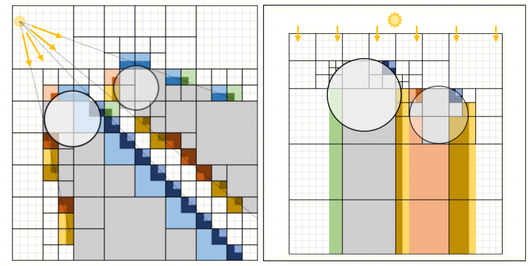

原论文中定向光源体素划分示意图

 
而本文是实现点光源的Voxel Shadow, 点光源的投影方式为透视投影, 我们无法像定向光源那样直接按照视图空间坐标进行划分。于是我提出一种针对透视投影的非均匀划分方式, 如下图

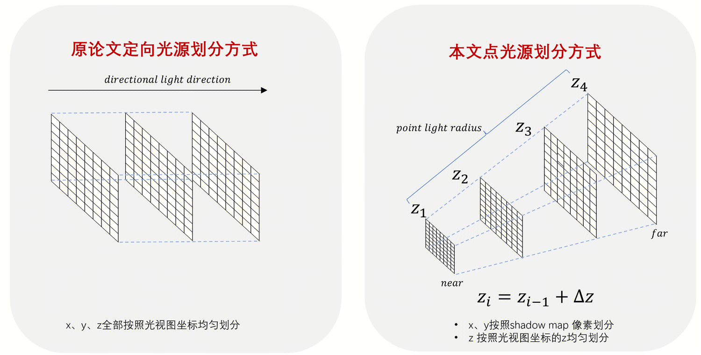

从图中可知, 定向光源的投影方式为正交投影, 其视椎体是一个立方体(其实是长方体, 但在具体实现时会将其扩为一个立方体), 这能够保证投影前后的一致性, 使每一次划分出的体素都为立方体。

而点光源的投影方式为透视投影, 它的视椎体是一个棱台, 我们不能再像正交投影那样在视图空间中均匀划分, 而且透视投影的Z坐标在投影前后并非是线性变化的。于是本文提出一种非均匀地划分方式：**按照Shadow Map的像素坐标划分X、Y, 但是按照光视图坐标来均匀划分Z, 这样能够保证划分结果是符合点光源的Shadow Map结果的。**

根据这种划分方式, 每个体素不再是标准的立方体, 而是一个个小棱台, 同时近处对应的体素更小, 而远处对应的体素更大。

### 1.2.3 状态存储
最终, 该算法能够得到一棵八叉树。

若每个结点单独存储自己的状态信息, 会导致存储效率较低（状态值仅有 2 个bit）。故在具体实现时, 是每个结点的父结点存储自己子结点的状态信息。由上文可知, 状态信息一共包含3个(Shadowed, UnShadowed, Mixed), 三种状态可以由 2 位二进制数进行表示, 而每个结点最多具有8个子结点, 故可以使用2 * 8=16位数表示 8 个子结点的可见性。

为方便做PCF, 当划分到8x8x8的时候, 不再使用以往的划分方法, 而是只在Z轴方向划分, 将其划分为8个8x8x1大小的片, 这个8x8x1的片即为一个叶子结点, 该片中含有64个体素, 因为这个时候的体素不会是Mixed, 故每个体素只用使用一个bit存储可见性, 可以直接使用64bit进行存储。

## 1.3 遇到的问题与解决方式
### 1.3.1 目前渲染结果
通过上述方法能够成功渲染出正确的阴影，如下图
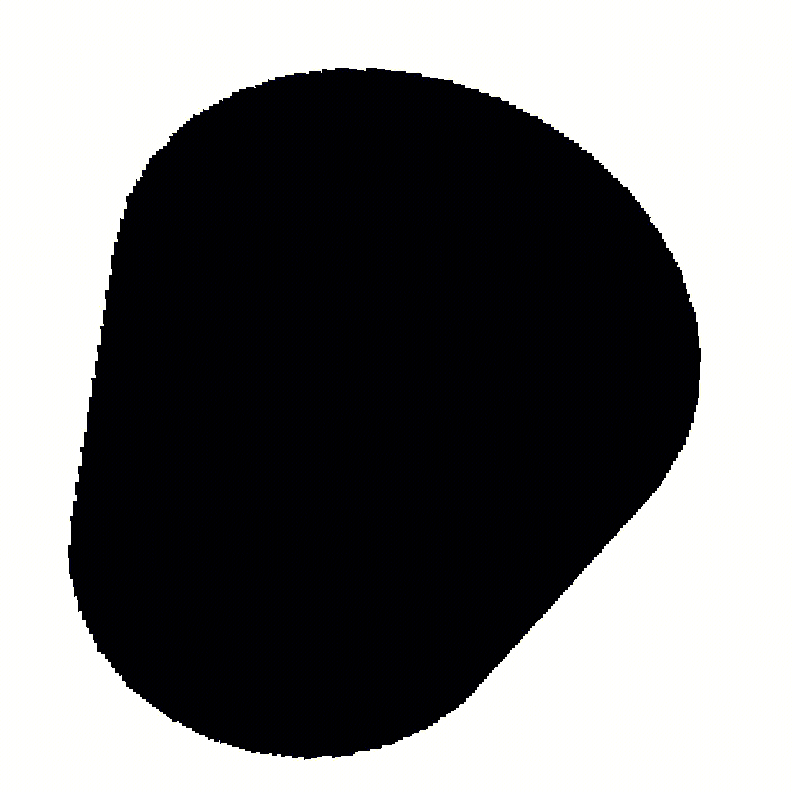
但从图中可以看到，阴影边缘具有较多锯齿，我们考虑使用PCF来对阴影边缘进行柔和处理。

### 1.3.2 原论文中PCF实现
原论文中的PCF方法是提前生成每个叶子结点中每个子体素周围叶子结点的Bit Mask，然后根据该Bit Mask在shader中去读取周围叶子结点，再通过阴影体素所占百分比来决定像素最终的阴影值，结果如下
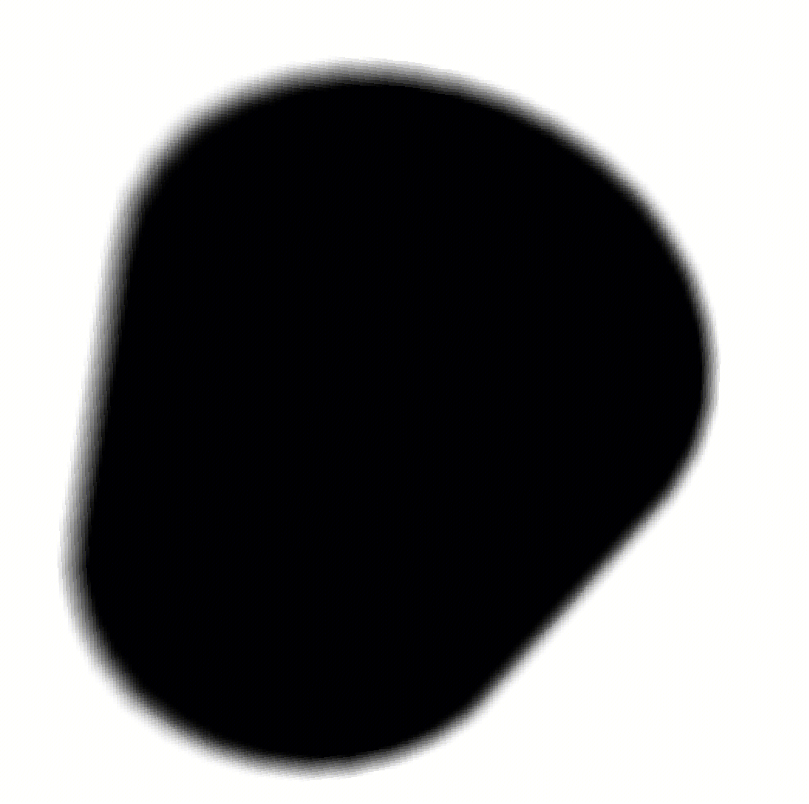 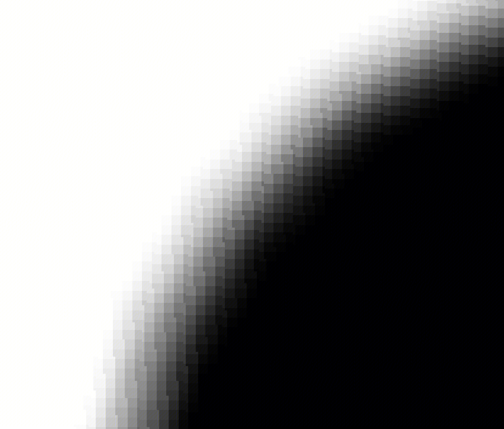
从图中可以看出，该方法的结果从远处看能够得到较好的平滑效果。但是该PCF结果平滑的单位是体素而非像素，所以离近了看会发现像素之间的过度并不平滑，同时该方法在Shader中会多次遍历树，会导致性能不佳。

### 1.4.1 Leaf Expanding
为解决原论文中存在的边缘像素过度不平滑以及性能问题，本文提出一种冗余体素外扩的方法。PCF的本质其实是将阴影数据做一次Blur，而Blur则需要配获取其周围像素/体素的阴影的数据，传统Shadow Map的PCF可以直接采样周围的Shadow Map的值。但是对于Voxelized Shadow，采样周围的阴影值所付出的代价会更高，做Voxelized Shadow 的PCF主要有以下几个特点：
- 若着色点所对应的体素位置在叶子结点的内部，则可以直接读取64bit的LeafMask，既可以完成很好的PCF 效果，且不涉及更多的采样了。
- 若着色点对应的体素位置在叶子结点的边缘处，就必须采样周围叶子结点的阴影数据，但这会设计到多次遍历树，从而造成更大的性能开销。

为解决上述问题，本文提出一种冗余体素外扩的方法。该方法将8x8x1的叶子结点外扩为9x9x1，其中有效的阴影数据依然是8x8x1，而多出来的那一圈数据则仅用于实现PCF。
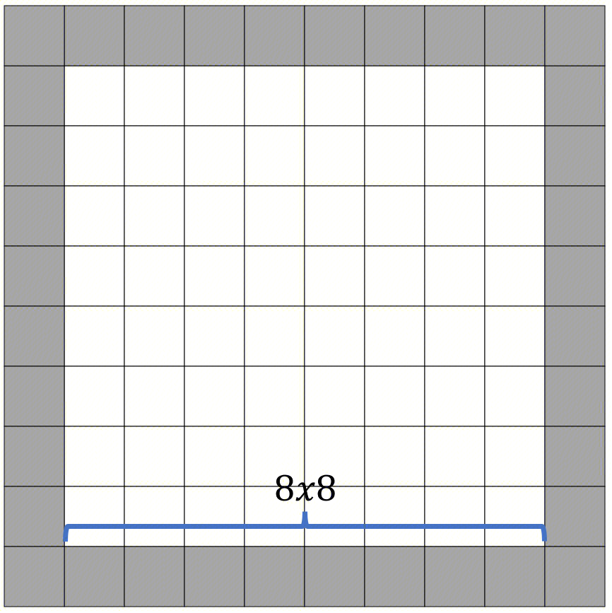

之后，在Shader中按照像素的uv进行插值可以得到较好的1x1 PCF效果
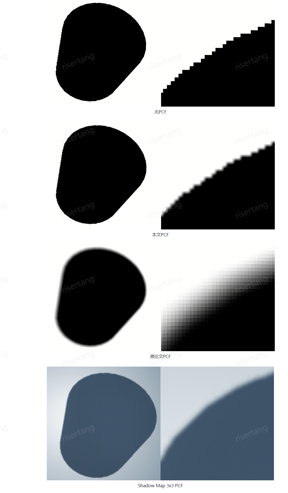

该方法也具有一些问题：
- 支持PCF是以压缩率为代价的，因为外扩叶子结点会影响叶子结点的哈希值计算，导致能够合并的结点数量变少，压缩率降低。
- 无法再支持更大的PCF，更大的PCF会进一步降低压缩率，削弱本文方法的优势。

使用该方法实现3x3 PCF，从远处看能够得到较好的效果，但是离近看就会看到一些明显的突变，这是由于使用1x1 PCF的数据来计算3x3 的PCF所导致的错误。
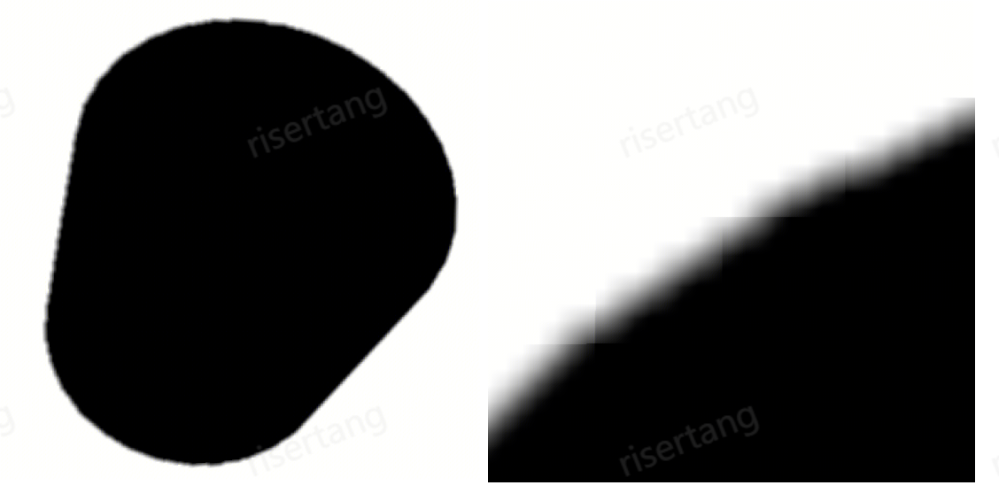

### 1.4.2 重投影性能优化
经过性能测试Voxelized Shadow存在较大的性能问题，高PCF的性能更差。

于是我就开始实现重投影方法，经过半周的实现与Debug，最后达到了最高40%的性能提升，该方法的核心思想如下：由于计算Voxelized Shadow，需要在Shader中遍历八叉树以得到阴影数据，这一个过程非常耗时，所以我们可以利用重投影方法去复用上一帧的Shadow Mask，以减少当前帧的渲染开销。计算当前着色像素的世界空间坐标，将该坐标乘上上一帧的ViewProjectionMatrix，得到上一帧的ClipSpace，从而计算出UV，通过UV去采样上一帧的ShadowMask，为防止出现当前帧的位置在上一帧并不可见，需要继续采样上一帧的DepthBuffer，判断投影过去的位置在上一帧是否可见，若不可见则重新计算新的值，如果可见则直接复用上一帧的值。

## 1.5 移动端性能与效果测试
### 1.5.1 测试场景
测试的游戏demo依然选择室内卧室场景，但是我在之前场景中加入了更多细小的物体，以保证场景阴影的复杂性。同时为方便进行性能测试，在demo中采用两种固定视角进行测试：近景阴影与远景阴影。性能数据均来自于远景阴影视角。
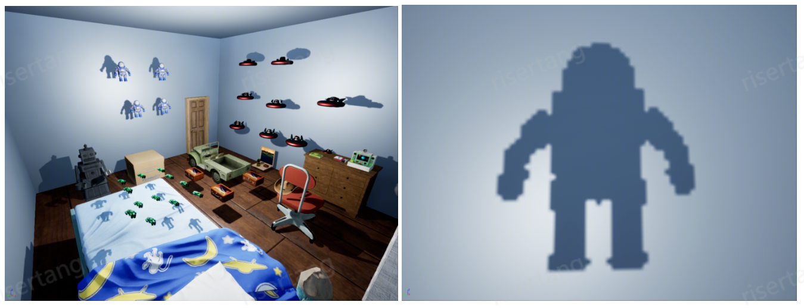

左图为远景（用于测试性能），右图为近景（用于观察不同PCF方法实现的渲染效果）

除此以往，我还编写了ui测试脚本，将测试的几个参数使用ui控制来进行切换，如下：
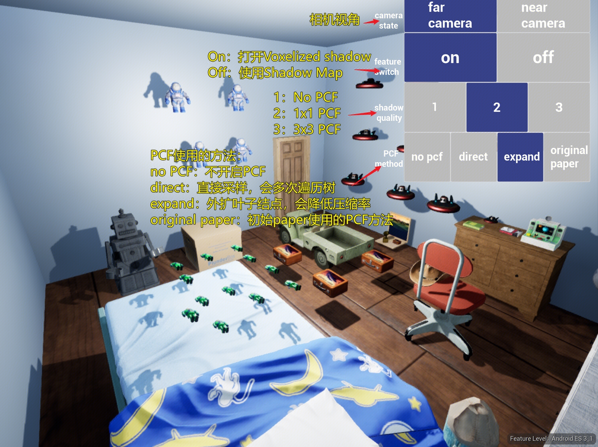

测试的移动设备的详细参数如下：
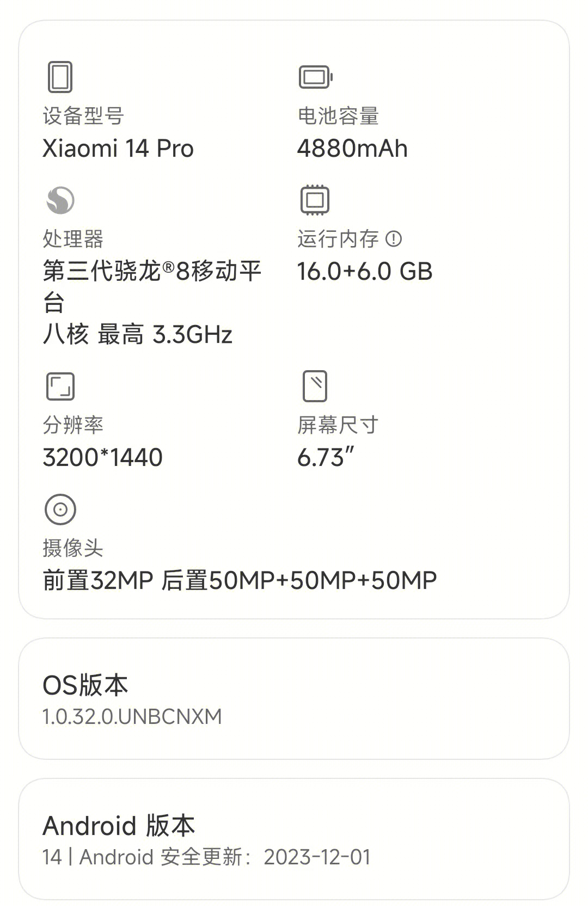

### 1.5.2 性能测试
所有性能测试数据均由SnapDragonProfiler捕获得到，具体结果计算方式为通过SnapDragonProfiler连续跟踪真机GPU 10秒，计算Voxelized Shadow Render Pass的耗时平均值。同时为保证数据结果更具有代表性，所有结果在两段不连续时间段内进行捕获测试，并取平均值。

在不同分辨率、不同Shadow Quality、不同PCF method的参数下，分别测试性能与内存占用，具体测试结果如下：
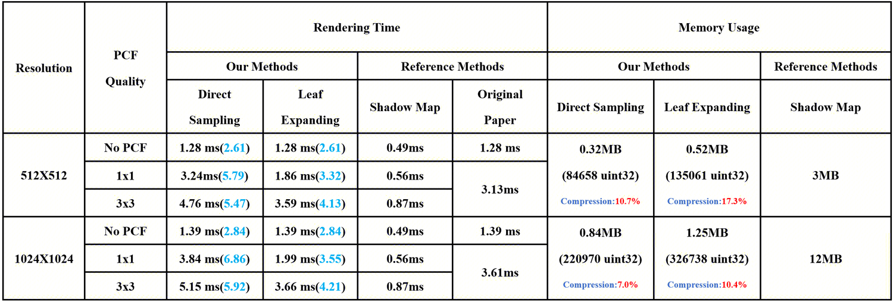

表中Rendering Time栏目中的蓝色数字表示该方法下的耗时相比于同参数下Shadow Map耗时的倍数，表中Memory Usage栏目中的红色字体为该方法相对于Shadow Map的压缩率。uint32是Voxelized Shadow底层Strcuted Buffer的数据格式，这里为方便后期数据理解，故特意标出。

由表中，我们可以得出以下结论：

1. Voxelized Shadow能够获得极佳的压缩率，512与1024分辨率下，能够分别获得最高10.7% 与 7.0%的压缩率，这里的压缩率指的是压缩后的结果大小占原始结果的百分比。理论上，分辨率越高，最后的压缩率会更低，压缩效果会更好，因为底层结点将会更大概率发生重合，从而被压缩至一个结点，具体原理见6.1。

2. 目前Voxelized Shadow面临最严峻的问题是性能问题。在手机上，Voxelized Shadow在不开启PCF并使用512分辨率情况下，也需要1.28ms进行渲染，其时间为Shadow Map的2.61倍，若采用直接采样的方式计算3x3 PCF则会达到更高的5.15ms，是Shadow Map的5.92倍，这对于阴影计算来说，显然是不可接受的。后期将会重点思考如何优化效率。

3. 为提升Voxelized shadow的性能，不宜使用direct sampling的PCF方法，因为这会导致在Shader中多次遍历树，会造成极大的性能开销，所以我们应该尽可能地保证仅在Shader中遍历一次树。

### 1.5.3 效果测试
我们选用近景阴影进行效果测试，具体结果如下：
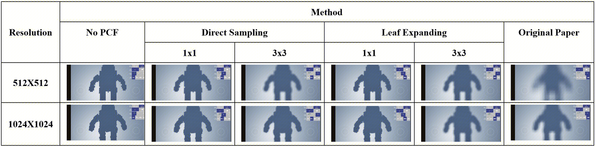

## 1.6 重投影性能测试
本节在上节测试的基础上优化了Shader中分支相关的代码，并实现了重投影性能优化，本节将会测试在使用重投影前后性能的变化。在本节测试中，相机不再是静止的，而是运动的，因为重投影的测试只有在相机运动时进行测试，其结果才具有参考性，为保证测试结果的准确性，我使用snapdragonprofiler进行性能分析，并逐帧trace渲染10s，求取10s中ShadowMask渲染时间的平均值。
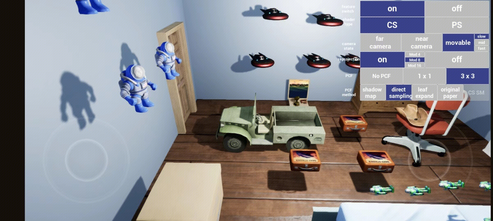
测试的结果如下：
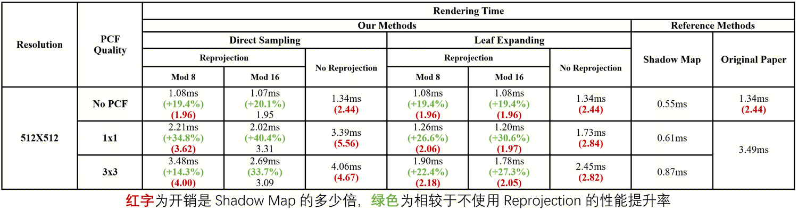
从中可知，
1. 采用重投影方法之后，性能得到一定程度的提升，但是由于每一帧依然需要固定更新某些GroupThread，使得性能提升有限。
2. 目前最支持的方法是使用LeafExpanding方法，并开启重投影，使用3x3 PCF，其耗时为1.78ms
3. 重投影方法能够带来明显的性能提升，但是在移动端依然无法将VoxelizedShadow控制在1ms以内。

## 2. 基于SceneExtension实现的体积云

该体积云项目完全由本人独立开发, 为自己的硕士研究方向。该项目利用UE4的Global Shader与RDG进行自定义渲染, 通过空间上采样与重投影的方法提高体积云渲染性能。同时优化体积云多重散射, 进一步提高体积云的真实性。

### 2.1 效果图
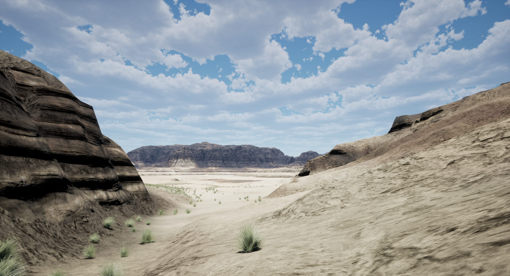

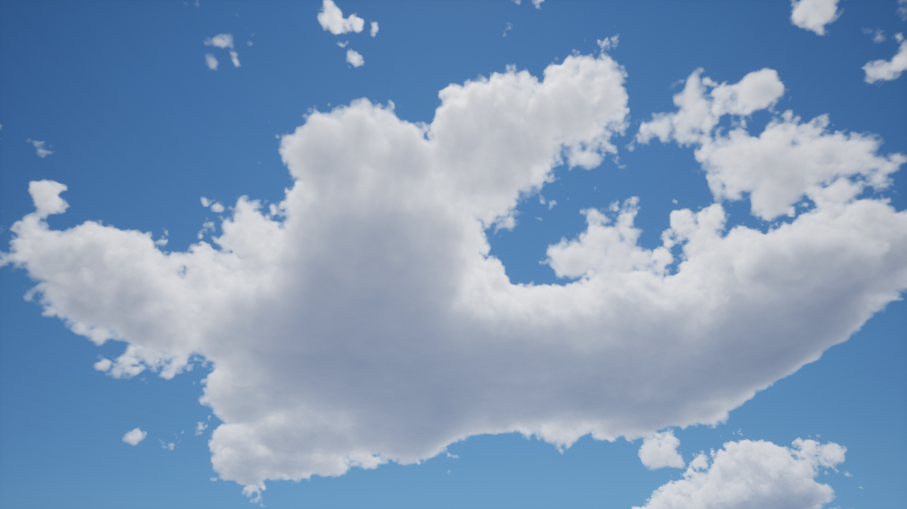

### 2.2 重投影与空间上采样降低整体每一帧渲染的像素数量

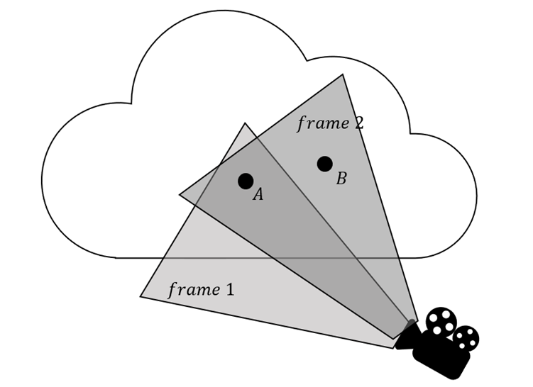
在空间上, 将屏幕分辨率降低为原来的一半, 最后利用插值的办法将结果进行上采样, 有效降低
整体渲染的像素数量。在时间上, 通过每一帧渲染一个4x4的block中的一个像素, 从而降低每一帧需要渲染的像素数量。以下为算法的流程：

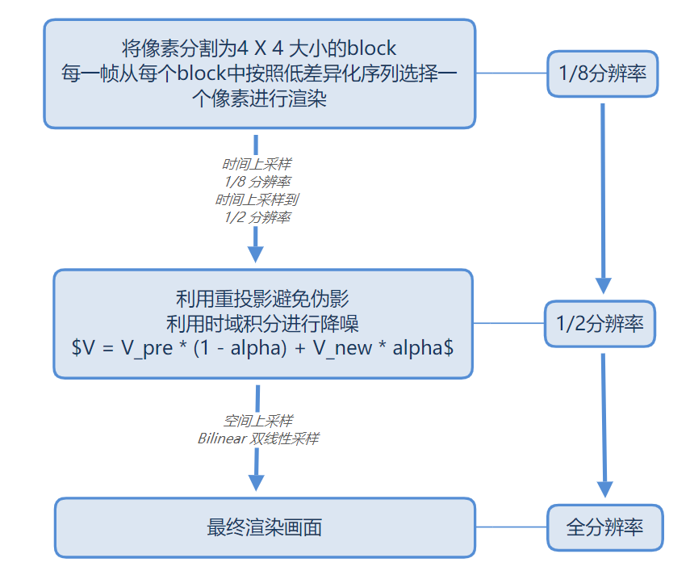

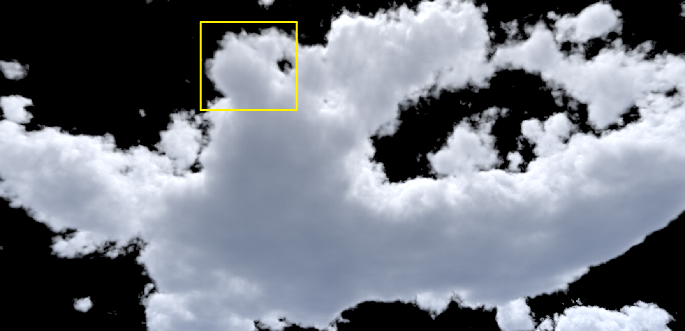

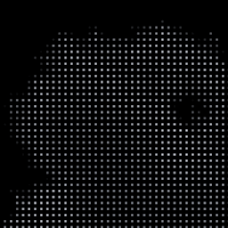

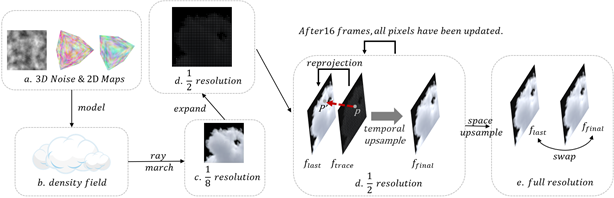

### 2.3 多重散射近似效果

只有beer powder

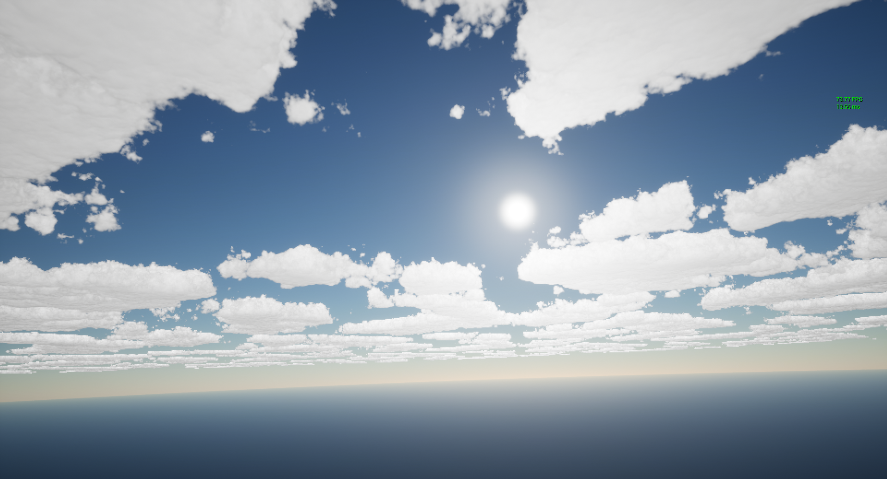

添加光线衰减

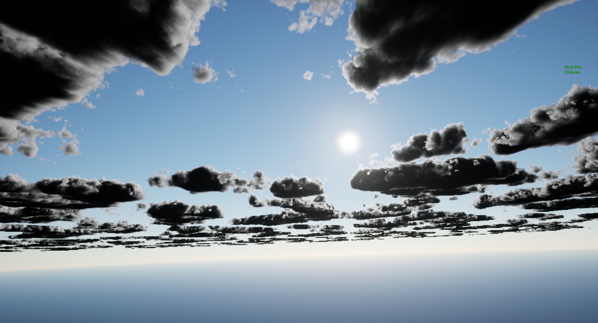

添加大气透视

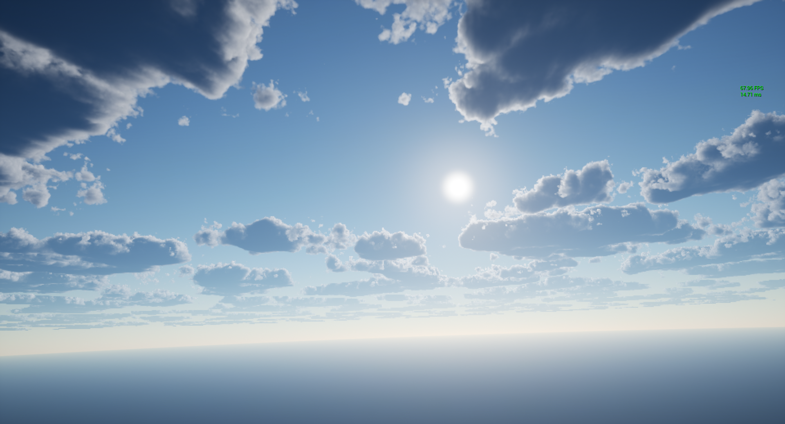

添加多重散射近似

添加Ambient Light

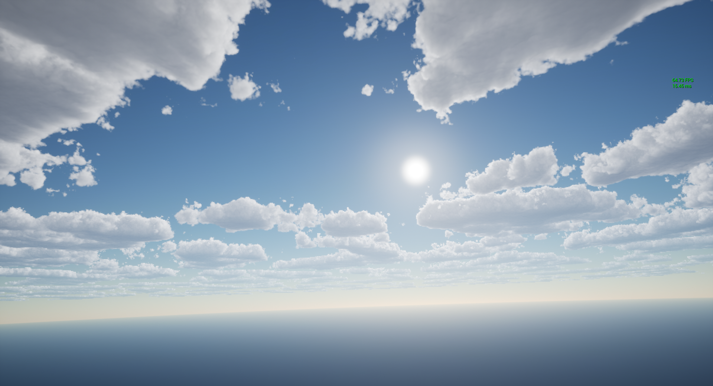

添加能量守恒方程
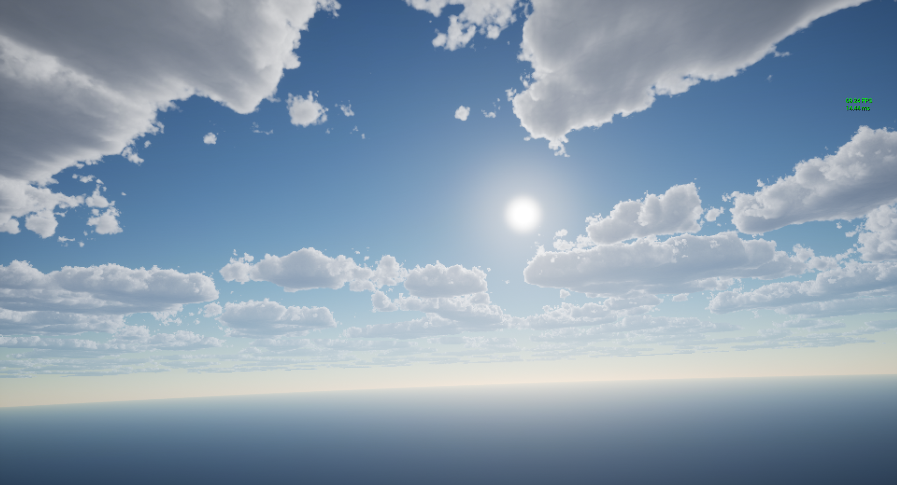

### 2.4 基于预步进的近景体积云渲染优化方法
近年来, 体积云渲染技术在各个应用领域都取得了显著进展. 然而, 大部分渲染方法仅适用于远景体积云, 而对于近景可穿越体积云, 其渲染效果和性能往往不理想. 针对这一问题, 提出了一种基于预步进的自适应采样优化方法, 以提升近景可穿越体积云的实时渲染效果. 首先, 通过预步进与探针下采样, 生成云层的密度分布信息. 根据该信息, 针对性地增加极近采样点数量, 并围绕非空采样点调整采样点分布, 解决相机位于云层边缘时的噪点问题和射线路径上的无效采样问题. 最后, 为解决低分辨率预步进探针带来的渲染结果不一致的问题, 采用相似度加权的方法优化最终着色结果. 实验结果表明, 本文的优化方法在应对穿越积云等成块分布的云层时, 渲染效果和性能提升明显, 其PSNR相较于均匀步长策略提升4.62%, 性能提升4.59%.

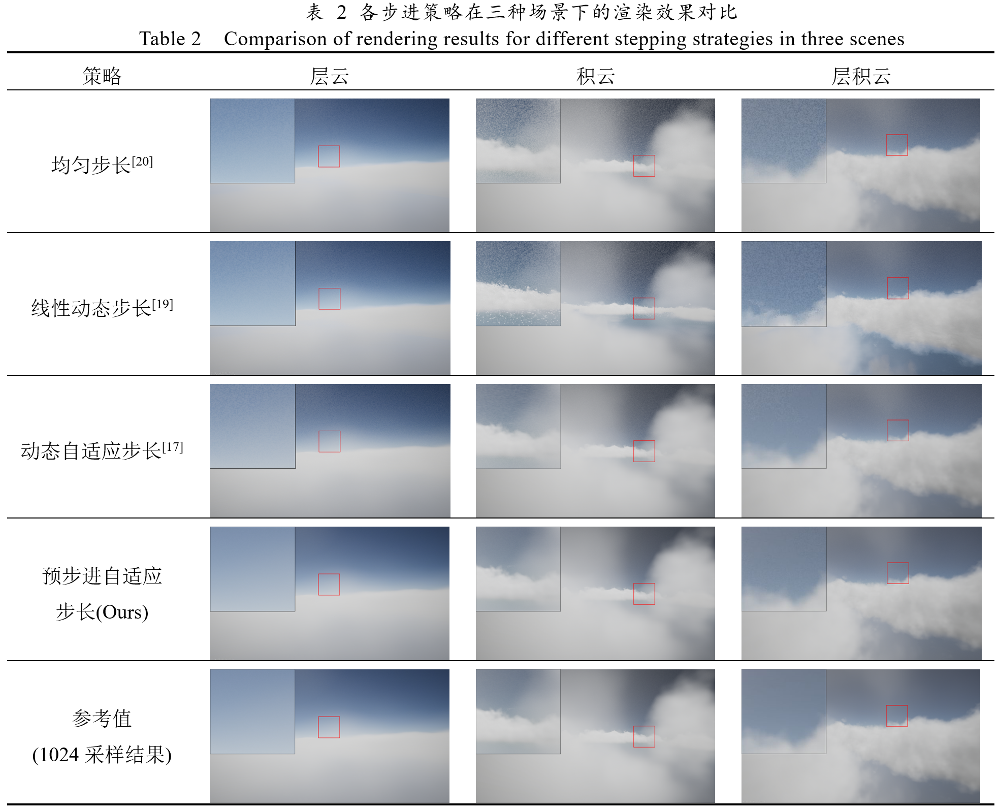

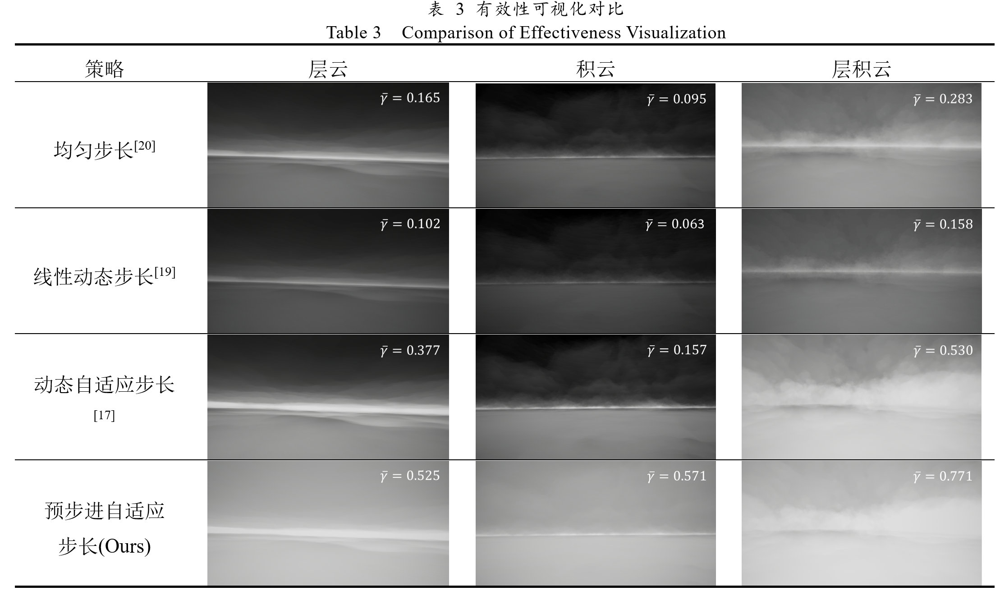

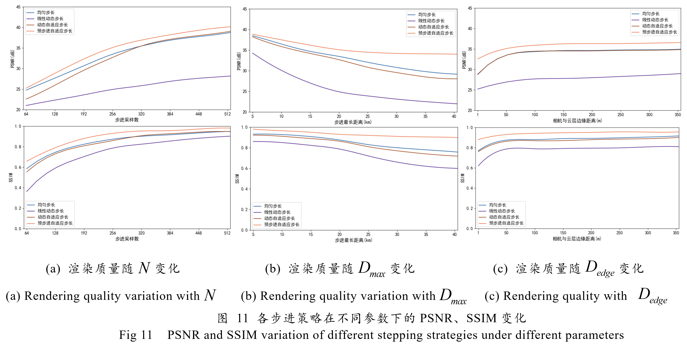

### 2.5 体积云分布定制与云雷达
见本人知乎博客
https://zhuanlan.zhihu.com/p/580288506
https://zhuanlan.zhihu.com/p/708847114